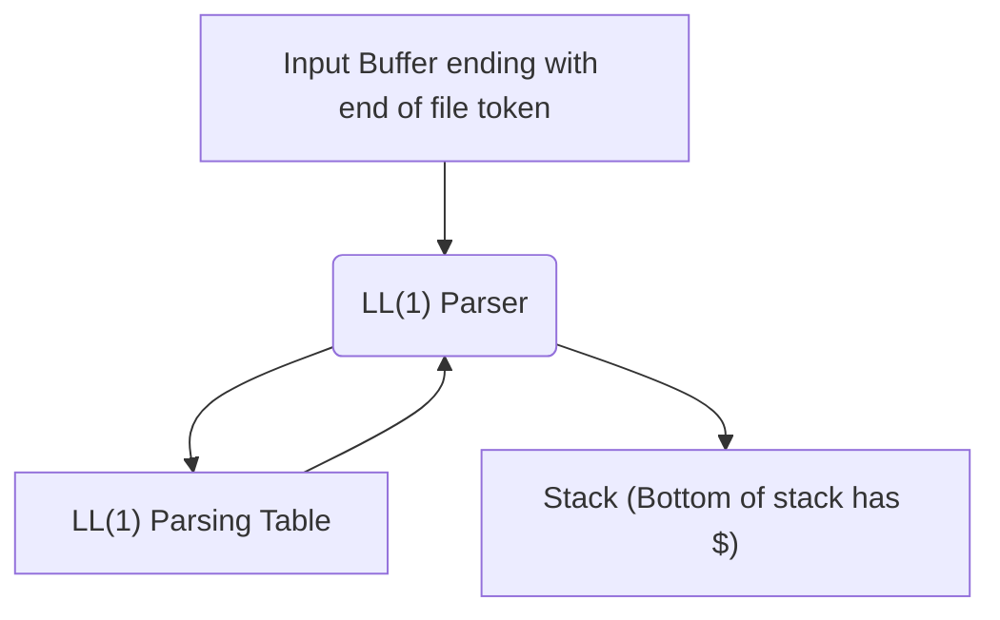

# IIL Parser LL(1)

```mermaid
flowchart TD
    A[Input Buffer ending with end of file token] --> B("LL(1) Parser")
    B --> C["LL(1) Parsing Table"] --> B
    B --> D["Stack (Bottom of stack has $)"]

```
